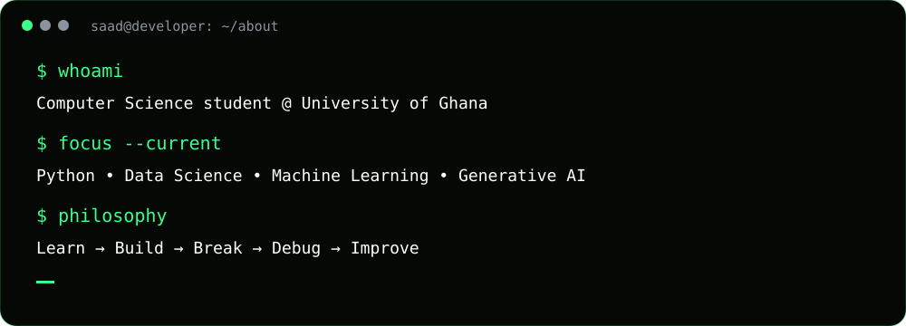
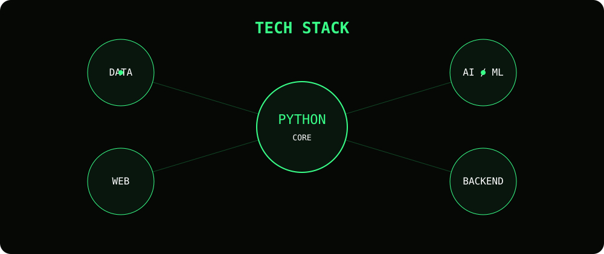
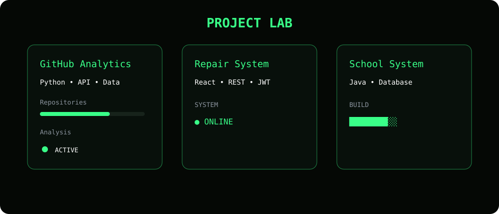
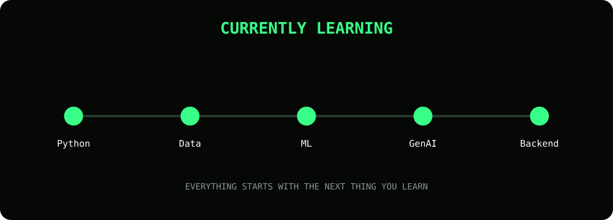

<p align="center">
  
</p>

<p align="center">
  
</p>

<p align="center">
  <a href="https://github.com/isaad-ui">
    
  </a>
  <a href="https://www.linkedin.com/in/issaka-sa-ad-timbilla/">
    
  </a>
</p>

---

<p align="center">
  
</p>

---

<h2 align="center">🧠 WHAT I BUILD</h2>

<p align="center">

```text
DATA          →  ANALYZE  →  INSIGHTS
SOFTWARE      →  DESIGN   →  SYSTEMS
AI            →  EXPERIMENT → APPLICATIONS
WEB           →  BUILD    →  EXPERIENCES
```

</p>

---

<p align="center">
  
</p>

---

<p align="center">
  
</p>

---

<h2 align="center">⚡ DEVELOPER MODE</h2>

<p align="center">


</p>

---

<p align="center">
  
</p>

---

<h2 align="center">🔥 GITHUB ACTIVITY</h2>

<p align="center">
  
</p>

<p align="center">
  
</p>

---

<h2 align="center">📊 GITHUB STATS</h2>

<p align="center">
  
  
</p>

---

<h2 align="center">🎯 CURRENT MISSION</h2>

<p align="center">


</p>

---

<p align="center">

```text
I don't want to only learn technology.

I want to understand it.
Build with it.
And use it to solve meaningful problems.
```

</p>

---

<p align="center">
  
</p>

<p align="center">
  <strong>Issaka Sa-ad Timbilla</strong>
</p>
